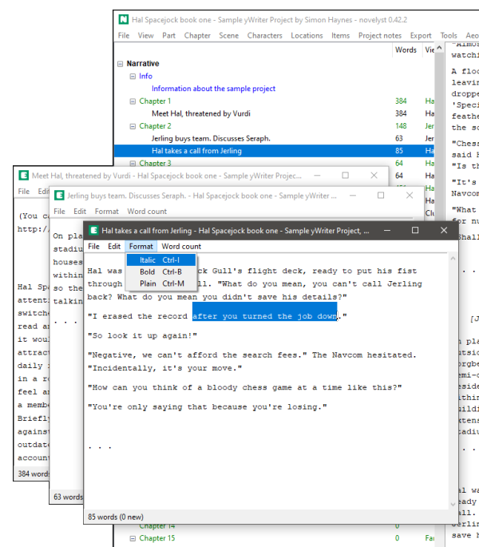

# novelyst_rich_editor

The [novelyst](https://peter88213.github.io/novelyst/) Python program helps authors organize novels.  

*novelyst_rich_editor* is a plugin providing a "rich text" scene editor. 

## Features

- A simple "rich text" editor box without search capability.
- "Bold" and "Ialic" are rendered; other formatting is shown as markup.
- Multiple scene editor windows.
- Word count is displayed and updated either live or on demand.
- The application is ready for internationalization with GNU gettext. A German localization is provided. 
- Editor features:
    - Text selection
    - Copy/Cut/Paste to/from the clipboard
    - Undo/Redo
    - Key shortcuts for bold and italic formatting

*Note:* If you rather have a "full markup" scene editor, you might wish to try the [novelyst_editor](https://peter88213.github.io/novelyst_editor) plugin.

## Requirements

- [Python 3.6+](https://www.python.org). 
- Tk support for Python. This is usually part of the Windows Python installation, but may need to be installed additionally under Linux.
- [novelyst](https://peter88213.github.io/novelyst/) version 1.0.0+

## Download and install

[Download the latest release (version 0.8.0)](https://github.com/peter88213/novelyst_rich_editor/raw/main/dist/novelyst_rich_editor_v0.8.0.zip)

- Unzip the downloaded zipfile "novelyst_rich_editor_v0.8.0.zip" into a new folder.
- Move into this new folder and launch **setup.pyw**. This installs the plugin.
- Open "README.md" for usage instructions.

### Note for Linux users

Please make sure that your Python3 installation has the *tkinter* module. On Ubuntu, for example, it is not available out of the box and must be installed via a separate package. 

------------------------------------------------------------------

[Changelog](changelog)

## Usage

See the [instructions for use](usage)

## License

This is Open Source software, and the *novelyst_rich_editor* plugin is licenced under GPLv3. See the
[GNU General Public License website](https://www.gnu.org/licenses/gpl-3.0.en.html) for more
details, or consult the [LICENSE](https://github.com/peter88213/novelyst_rich_editor/blob/main/LICENSE) file.
